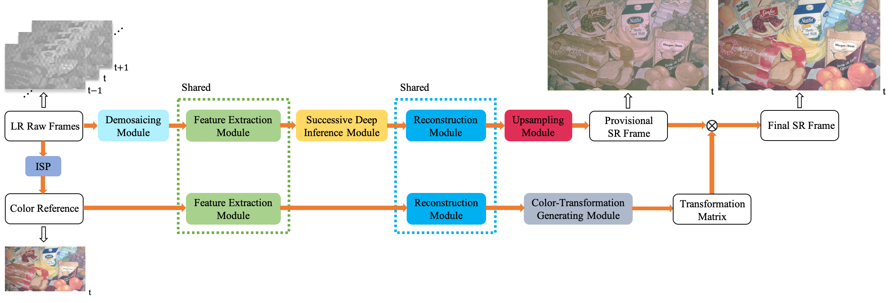
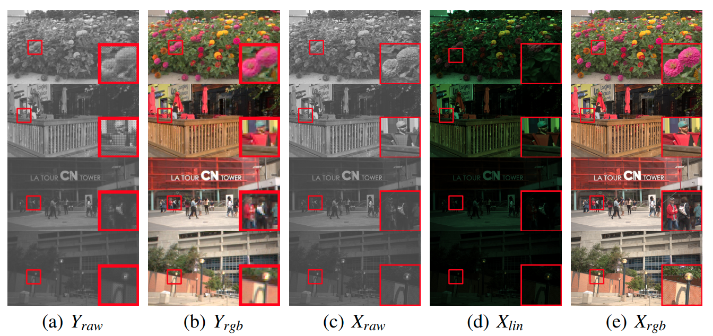

# RawVSR
This repo contains the official codes for our paper:

### Exploit Camera Raw Data for Video Super-Resolution via Hidden Markov Model Inference
[Xiaohong Liu](https://xiaohongliu.ca), Kangdi Shi, Zhe Wang, [Jun Chen](http://www.ece.mcmaster.ca/~junchen/)



Accepted in _IEEE Transactions on Image Processing_

[[Paper Download](https://arxiv.org/abs/2008.10710)]
___


## Dependencies and Installation
- Python >= 3.8 (Recommend to use [Anaconda](https://www.anaconda.com/download/#linux))
- [PyTorch >= 1.7.0](https://pytorch.org/)
- NVIDIA GPU + [CUDA](https://developer.nvidia.com/cuda-downloads)

1. Clone repo
    ```bash
    $ git clone https://github.com/proteus1991/RawVSR.git
    ```
1. Install dependent packages

    ```bash
    $ cd RawVSR
    $ pip install -r requirements.txt
    ```
1. Setup the Deformable Convolution Network (DCN)
   
    Since our RawVSR use the DCN for feature alignment extracted from different video frames, we follow the setup in [EDVR](https://github.com/xinntao/EDVR#wrench-dependencies-and-installation), where more details can be found.
    ```bash
    $ python setup.py develop
    ```
   
    Note that the ```deform_conv_cuda.cpp``` and ```deform_conv_cuda_kernel.cu``` have been modified to solve [compile errors](https://github.com/open-mmlab/mmediting/issues/84) in PyTorch >= 1.7.0. If your PyTorch version < 1.7.0, you may need to download the original setup code.

## Introduction
- ```train.py``` and ```test.py``` are the entry codes for training and testing the RawVSR.
- ```./data/``` contains the codes for data loading.
- ```./dataset/``` contains the corresponding video sequences.
- ```./dcn/``` is the dependencies of DCN.
- ```./models/``` contains the codes to define the network.
- ```./utils/``` includes the utilities.
- ```./weight_checkpoint/``` saves checkpoints and the best network weight. 

## Raw Video Dataset (RawVD)
Since we are not aware of the existence of publicly available raw video datasets, to train our RawVSR, 
a raw video dataset dubbled as **RawVD** is built.


- RawVD download (>60G): [BaiduYun](https://pan.baidu.com/s/1ZMOXxiCE1K1RqfdMamWjXg), password: b300.

- Only test dataset: [Google Drive](https://drive.google.com/file/d/1N2rX52lU175-7KsffSAPl-qUuX8iJ_WB/view?usp=sharing).
   

In this dataset, we provide the ground-truth sRGB frames in folder ```1080p_gt_rgb```. Low-resolution (LR) Raw frames are in folder ```1080p_lr_d_raw_2``` and ```1080p_lr_d_raw_4``` in terms of different scale ratios.
Their corresponding sRGB frames are in folder ```1080p_lr_d_rgb_2``` and ```1080p_lr_d_rgb_4```, where **d** in folder name stands for the degradations including defocus blurring and heteroscedastic Gaussian noise. 
Details can be found in Section 3 of our paper.

## Quick Start

### 1. Testing
Make sure all dependencies are successfully installed.

Run ```test.py``` with ```--scale_ratio``` and ```save_image``` tags.
```bash
$ python test.py --scale_ratio 4 --save_image
```
The help of ```--scale_ratio``` and ```save_image``` tags is shown by running:

```bash
$ python test.py -h
```

If everything goes well, the following messages will appear in your bash:

```
--- Hyper-parameter default settings ---
train settings:
 {'dataroot_GT': '/media/lxh/SSD_DATA/raw_test/gt/1080p/1080p_gt_rgb', 'dataroot_LQ': '/media/lxh/SSD_DATA/raw_test/w_d/1080p/1080p_lr_d_raw_4', 'lr': 0.0002, 'num_epochs': 100, 'N_frames': 7, 'n_workers': 12, 'batch_size': 24, 'GT_size': 256, 'LQ_size': 64, 'scale': 4, 'phase': 'train'}
val settings:
 {'dataroot_GT': '/media/lxh/SSD_DATA/raw_test/gt/1080p/1080p_gt_rgb', 'dataroot_LQ': '/media/lxh/SSD_DATA/raw_test/w_d/1080p/1080p_lr_d_raw_4', 'N_frames': 7, 'n_workers': 12, 'batch_size': 2, 'phase': 'val', 'save_image': True}
network settings:
 {'nf': 64, 'nframes': 7, 'groups': 8, 'back_RBs': 4}
dataset settings:
 {'dataset_name': 'RawVD'}
--- testing results ---
store: 29.04dB
painting: 29.02dB
train: 28.59dB
city: 29.08dB
tree: 28.06dB
avg_psnr: 28.76dB
--- end ---

```
The RawVSR is tested on our elaborately-collected RawVD. Here the PSNR results should be the same as Table 1 in our paper.


### 2. Training
Run ```train.py``` without ```--save_image``` tag to reduce the training time.
```bash
$ python train.py --scale_ratio 4
```
If you want to change the default hyper-parameters (e.g., modifying the ```batch_size```), simply go ```config.py```. All network and training/testing settings are stored there.

## Acknowledgement
Some codes (e.g., DCN) are borrowed from [EDVR](https://github.com/xinntao/EDVR#wrench-dependencies-and-installation) with modification.


## Cite
If you use this code, please kindly cite
```
@article{liu2020exploit,
  title={Exploit Camera Raw Data for Video Super-Resolution via Hidden Markov Model Inference},
  author={Liu, Xiaohong and Shi, Kangdi and Wang, Zhe and Chen, Jun},
  journal={arXiv preprint arXiv:2008.10710},
  year={2020}
}
```

## Contact
Should you have any question about this code, please open a new issue directly. For any other questions, you might contact me in email: liux173@mcmaster.ca.